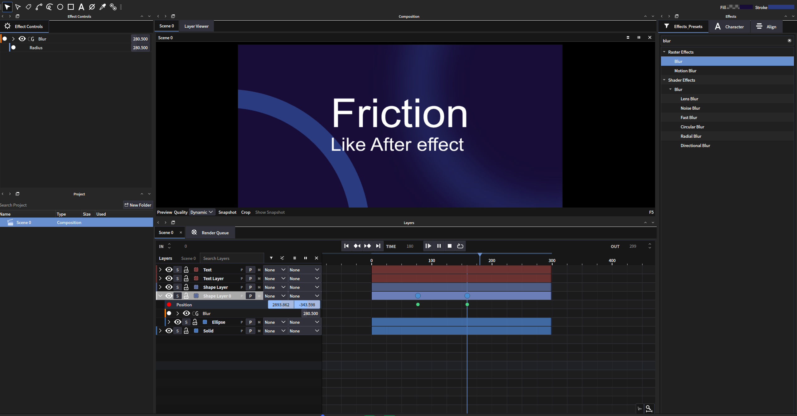

# Friction Modified - Like After Effects

这是一个基于 [Friction](https://github.com/friction2d/friction) 深度修改的2D动画软件，目标是打造Linux平台上的After Effects替代品。

**⚠️ 重要提示：这不是Friction的官方版本，所有问题请勿提交给原项目维护者！**

## ✨ 本版本的主要功能

## 🆕 本次更新 (2026-09-06)

### 预览缓存系统重写
- **修复缓存方向反转问题**：嵌套合成/ORA缓存不再"从右往左填"，严格按帧号递增顺序 0→1→2→3... 正向缓存
- **修复缓存提前停止问题**：移除 `previewHasBufferedAhead` 稳态检查，缓存持续进行直到全部帧完成，不再每60帧自动暂停
- **修复缓存范围收缩问题**：`renderDataFinished` 中宽范围缓存条目不再被窄范围替换，静态合成的绿色缓存条一次性填满
- **修复渲染游标回退问题**：移除 `renderCursorAheadOfNeed` 导致的游标暴力拉回逻辑，保持渲染方向一致
- **DI（Dependency Injection）缓存架构**：为 `HddCachableCacheHandler` 引入世代标记机制(`mCacheGeneration`)，支持场景变化时惰性驱逐旧缓存，避免全量清理
- **空闲缓存跨度扩展**：从2s/1s扩展到5s/3s，暂停时预缓存更多帧

### 保存/加载修复
- **修复视频导入后保存再打开只剩一帧**：`VideoBox`/`ImageSequenceBox` 在文件数据异步加载完成前不再调用 `animationDataChanged()`，等待 `reloaded` 信号再更新动画范围
- **修复素材命名问题**：`prp_sFixName()` 不再剥离前导数字，保留 `-` `.` 等合法字符，文件名不再变成"N/A"前缀

### 多选编辑增强
- **多选盒子同步关键帧**：选中多个盒子后，在属性上 Add/Delete Key 会同步应用到所有选中盒子的对应属性（类似AE）

### Tab键导航重写
- **合并场景链+组层级**：多场景时Tab弹出同时显示场景路径和当前场景的组层级，不再丢失上下文
- **修复ORA残留链**：从ORA合成返回普通合成时，导航链正确清除ORA层级，不再显示错误的层级关系
- **根节点使用实际合成名**：不再显示硬编码的"Composition"替代实际合成名

### Project面板重组
- **系统文件夹分组**：合成自动归入 `Compositions` 文件夹，素材自动归入 `Footage` 文件夹
- **ORA包保持层级**：ORA导入的素材包保持原有的包/Compositions/Assets层级结构

### 音频修复
- **修复轨道清空后音频仍播放**：`eSound` 析构函数增加 `removeSound` 调用，确保盒子删除时音频立即停止

### 嵌套合成缓存传播
- **StateChanged信号**：`BoundingBox` content变化时emit `stateChanged`，`InternalLinkBox` 监听并传播 `planUpdate` 到主画布，确保修改嵌套合成后主画布缓存正确失效

### 代码清理
- 清理 `canvas.cpp` / `renderhandler.cpp` / `assetswidget.cpp` 中大量冗余代码和注释

### AE风格界面
- 重新设计的UI布局，模仿After Effects的工作流程
- 更直观的层级管理和时间轴操作

### 视频格式支持
- **WebM导入与Alpha通道支持** - 使用libvpx解码器正确处理带透明通道的WebM视频

### 图像格式支持
- **ORA合成导入** - 支持OpenRaster格式以合成形式导入，并支持热更新

### 层级关系系统
- **父子级关系** - 完整的父子级绑定系统
- **Whip连接** - 使用whip工具快速建立层级关联

### 蒙版与遮罩
- **AE轨道遮罩** - 支持类似After Effects的轨道遮罩功能
- **AE图层蒙版** - 选中轨道时使用钢笔/矩形/椭圆工具可直接创建蒙版

### 合成管理
- **Scene切换** - 像After Effects切换合成一样快速切换Scene

### 动画工具
- **AE木偶功能** - 加入木偶工具用于角色动画（可能存在稳定性问题，但基本可用）

### 快捷键优化
- 添加了一系列类似After Effects的快捷键
- Mark快捷键从M键改为小键盘*键

## ⚠️ 免责声明

**本项目代码完全由AI生成，处于"黑盒"状态，可能对Friction核心代码进行了深度修改。**

- 请勿将本版本的问题提交给Friction官方作者
- 欢迎提交Issue，但请附带详细的报错信息
- 欢迎其他开发者参与维护和优化

## 📋 原项目信息

本修改版基于：
- **原项目**：[Friction](https://friction.graphics) 
- **原作者**：Ole-André Rodlie and contributors
- **原项目GitHub**：https://github.com/friction2d/friction

## 📖 构建说明

* [Linux](https://friction.graphics/documentation/source-linux.html)
* [Windows](https://friction.graphics/documentation/source-windows.html)
* [macOS](https://friction.graphics/documentation/source-macos.html)

## 📄 许可证

本项目保持与原项目相同的许可证：

Friction is copyright &copy; Ole-André Rodlie and contributors.

This program is free software: you can redistribute it and/or modify it under the terms of the GNU General Public License as published by the Free Software Foundation, version 3.

**This program is distributed in the hope that it will be useful, but WITHOUT ANY WARRANTY; without even the implied warranty of MERCHANTABILITY or FITNESS FOR A PARTICULAR PURPOSE. See the [GNU General Public License](LICENSE.md) for more details.**

Friction is based on [enve](https://github.com/MaurycyLiebner/enve) - Copyright &copy; Maurycy Liebner and contributors.

Third-party software may contain other OSS licenses, see 'Help' > 'About' > 'Licenses' in Friction.

Source code for third-party software can be downloaded [here](https://download.friction.graphics/distfiles/).
